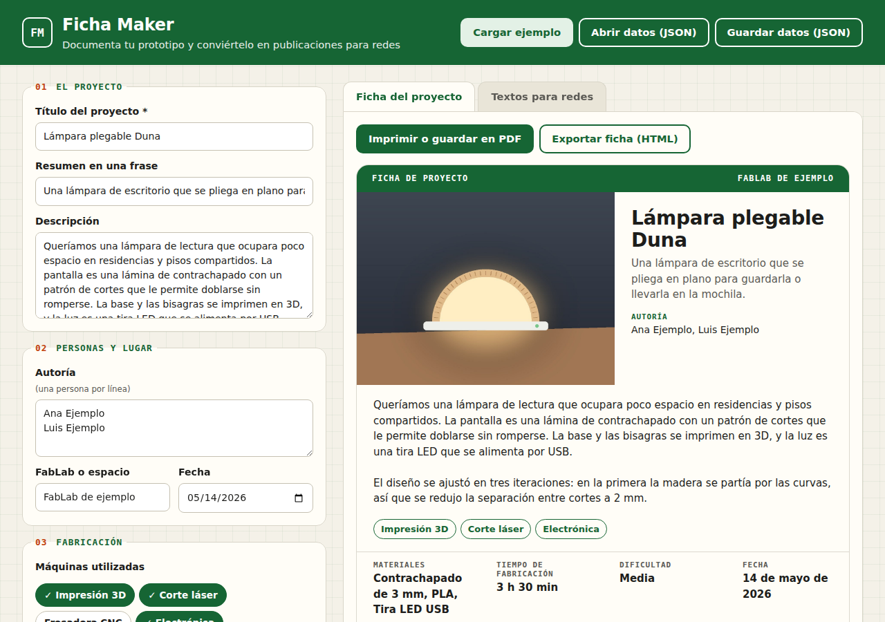

# Ficha Maker · De la ficha de proyecto al post para redes

[](https://doi.org/10.5281/zenodo.22913694)

Herramienta web para documentar un prototipo fabricado en un FabLab o espacio maker y convertir esa documentación en contenido de comunicación. A partir de un formulario genera una **ficha visual del proyecto**, lista para la web y para imprimir, y **textos adaptados para Instagram, LinkedIn y TikTok**, con la longitud, el tono y los hashtags de cada red. Es genérica y sirve para cualquier FabLab.



**Demo:** https://martamerchan.github.io/ficha-maker-redes/

## Funcionalidades

- **Formulario de documentación:** título, resumen, descripción, autoría, FabLab, fecha, máquinas utilizadas (impresión 3D, corte láser, fresadora CNC, electrónica, plóter de vinilo, bordadora, escáner 3D, termoformado u otra), materiales, tiempo de fabricación, dificultad, foto con texto alternativo, enlaces y licencia del diseño.
- **Ficha visual** que se actualiza mientras escribes, con **código QR** que lleva a la documentación.
- **Impresión o PDF:** al imprimir solo sale la ficha, sin el resto de la página.
- **Exportación de la ficha en HTML:** un único archivo independiente, con los estilos y la foto dentro, para publicarlo en una web o enviarlo.
- **Textos para redes:**
  - *Instagram:* tono cercano, datos del proceso en lista, llamada a la acción y hasta 8 hashtags.
  - *LinkedIn:* tono profesional, explica el proceso y la licencia abierta, incluye enlaces y hasta 4 hashtags.
  - *TikTok:* gancho corto al inicio, datos esenciales y hasta 5 hashtags.
  - Cada texto se puede editar y copiar, y tiene un contador de caracteres con aviso si supera la longitud recomendada o el límite de la red.
- **Hashtags sugeridos** según las máquinas y los materiales, siempre en CamelCase (`#CorteLaser`) para que los lectores de pantalla los lean bien.
- **Guardar y cargar los datos en JSON**, para volver a abrir una ficha y editarla más tarde.
- **Borrador automático** en el propio navegador, para no perder lo escrito si se cierra la página.
- Proyecto de ejemplo para ver cómo funciona.

## Cómo usarlo

1. Abre la [demo](https://martamerchan.github.io/ficha-maker-redes/) y, si quieres, pulsa **Cargar ejemplo**.
2. Rellena el formulario. La ficha de la derecha se actualiza al momento.
3. Añade una foto y su texto alternativo.
4. En la pestaña **Ficha del proyecto**, pulsa **Imprimir o guardar en PDF** o **Exportar ficha (HTML)**.
5. En la pestaña **Textos para redes**, revisa y edita cada texto, y pulsa **Copiar**.
6. Pulsa **Guardar datos (JSON)** para conservar la ficha. Para seguir con ella otro día, usa **Abrir datos (JSON)**.

## Formato de los datos (JSON)

```json
{
  "version": 1,
  "titulo": "Nombre del proyecto",
  "resumen": "Una frase",
  "descripcion": "Texto largo",
  "autores": ["Persona 1", "Persona 2"],
  "fablab": "Nombre del espacio",
  "fecha": "AAAA-MM-DD",
  "maquinas": ["impresion3d", "laser", "cnc", "electronica", "vinilo", "bordado", "escaner", "termoformado"],
  "otraMaquina": "",
  "materiales": ["Material 1", "Material 2"],
  "tiempo": { "horas": 3, "minutos": 30 },
  "dificultad": "basica | media | avanzada",
  "foto": "data:image/jpeg;base64,…",
  "altFoto": "Descripción de la foto",
  "enlaces": { "documentacion": "https://…", "archivos": "https://…", "video": "https://…" },
  "licencia": "CC BY-SA 4.0",
  "hashtagsExtra": "#MiHashtag"
}
```

La foto se reduce a un máximo de 1200 píxeles y se guarda dentro del propio JSON, para que el archivo tenga todo lo necesario.

## Tecnologías

- HTML5, CSS3 y JavaScript sin proceso de compilación.
- [qrcode-generator](https://github.com/kazuhikoarase/qrcode-generator) (licencia MIT, Kazuhiko Arase) para los códigos QR, incluida en `lib/` para que la herramienta no dependa de servicios externos.
- API Canvas para reducir las fotos, `Blob` para las descargas y `localStorage` para el borrador.
- Se publica con GitHub Pages.

## Estructura del proyecto

```
ficha-maker-redes/
├── index.html              Página principal y formulario
├── css/estilos.css         Estilos de la página e impresión
├── js/ficha.js             Ficha visual: HTML, estilos y exportación
├── js/redes.js             Textos para cada red y hashtags
├── js/app.js               Formulario, JSON, foto, pestañas y descargas
├── lib/qrcode.js           Librería de códigos QR (MIT)
├── ejemplo-proyecto.json   Proyecto de ejemplo (ficticio)
├── ejemplo-foto.jpg        Foto del proyecto de ejemplo (ilustración ficticia)
├── captura.png             Captura de pantalla para este README
├── CITATION.cff            Datos de cita (autoría, versión y fecha)
└── LICENSE                 Licencia MIT
```

## Privacidad

**Todo se procesa en local, en tu navegador.** Los datos del formulario y las fotos no se envían a ningún servidor. El borrador automático se guarda solo en el almacenamiento de tu navegador (`localStorage`) y puedes borrarlo con **Vaciar formulario**. La herramienta no usa cookies, analítica ni recursos de terceros.

## Datos de ejemplo

`ejemplo-proyecto.json` y `ejemplo-foto.jpg` son **ficticios**: el proyecto, las personas ("Ana Ejemplo", "Luis Ejemplo"), el FabLab y la foto (una ilustración) son inventados. Los enlaces apuntan a `example.org`, un dominio reservado para ejemplos.

## Licencia

Publicado con licencia [MIT](LICENSE). Puedes usarlo, modificarlo y redistribuirlo libremente, manteniendo el aviso de copyright. La librería `lib/qrcode.js` mantiene su propia licencia MIT.

## Autora

**Marta Merchán Albano**, 2026.

Desarrollado con asistencia de herramientas de inteligencia artificial. Diseño, personalización, pruebas y publicación: Marta Merchán Albano.

Si utilizas esta herramienta en un trabajo, puedes citarla con los datos de [`CITATION.cff`](CITATION.cff) (botón **Cite this repository** de GitHub).
